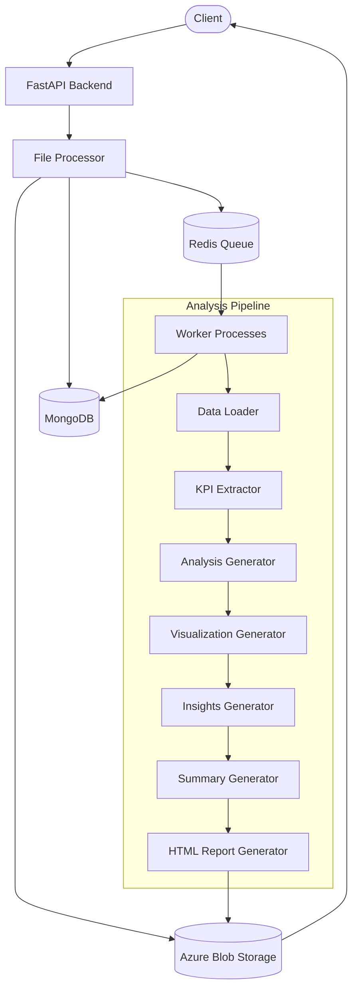
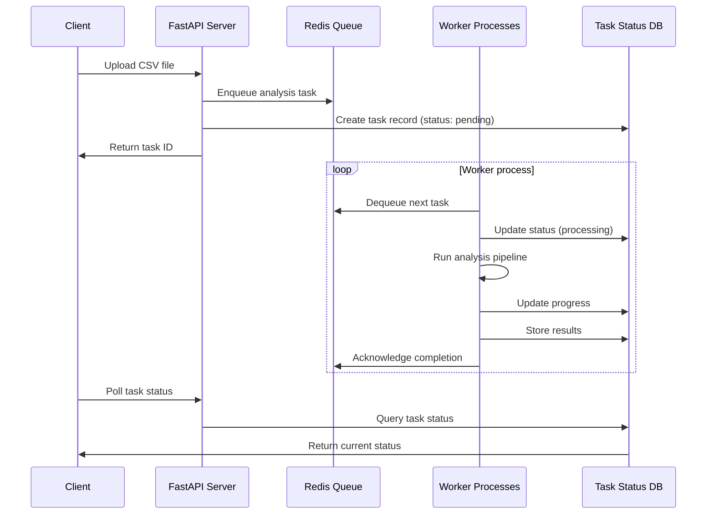
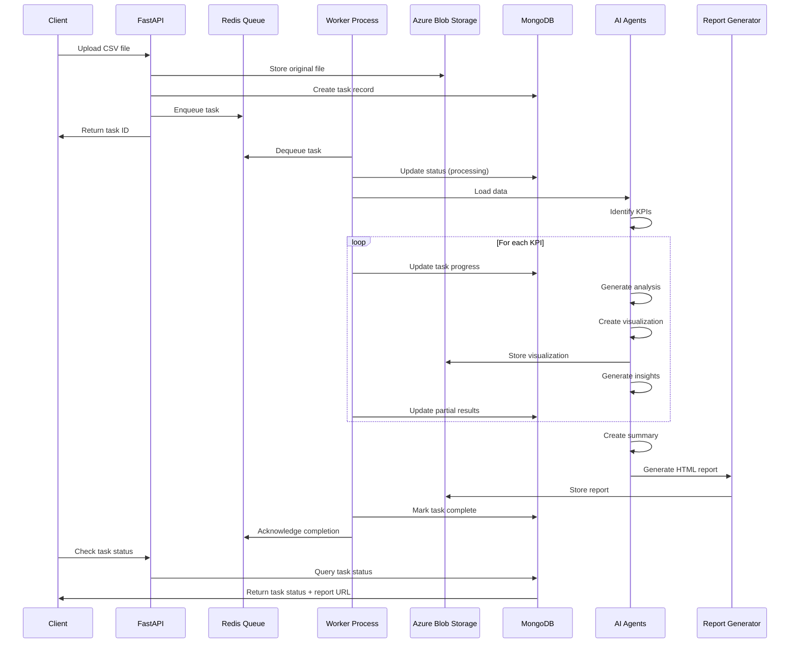
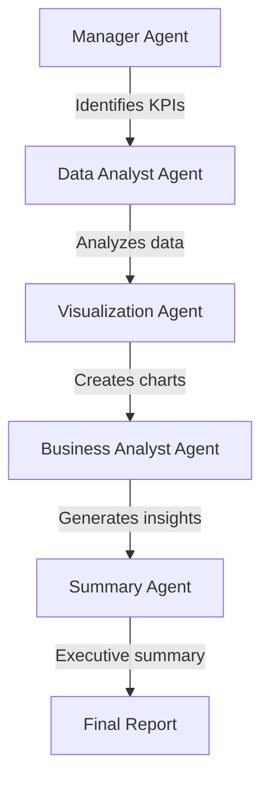

# Deep Analysis

## Overview
Deep Analysis is a powerful automated data analysis service designed to streamline the process of extracting insights from CSV files. Using a system of intelligent agents powered by AI, it automatically explores datasets, identifies key performance indicators (KPIs), generates visualizations, and produces comprehensive analytical reports with minimal human intervention.

This system is built with a FastAPI backend, AI agents powered by OpenAI's GPT models, Azure Blob Storage for file management, MongoDB for task tracking and logging, and Redis for distributed task processing.

## Architecture



## Distributed Task Processing Architecture

### Redis Queue System

Deep Analysis implements a robust distributed task processing system using Redis as a message broker. This architecture separates the web server (which handles API requests) from the worker processes (which perform resource-intensive data analysis), enabling high scalability, fault tolerance, and efficient resource utilization.

#### Key Components:

1. **Redis Queue**: Acts as a centralized task queue that stores pending analysis tasks
2. **Task Producer**: API endpoints that enqueue new analysis tasks
3. **Worker Processes**: Background processes that dequeue and execute tasks
4. **Watchdog Process**: Monitors for stale tasks and requeues them if workers fail

#### Why Redis?

- **In-memory performance**: Redis provides ultra-fast in-memory operations for task queuing
- **Reliability**: Supports task persistence and recovery mechanisms
- **Low latency**: Minimizes overhead in task distribution
- **Atomic operations**: Ensures tasks are processed exactly once under normal conditions
- **Scalability**: Easily scales horizontally as workload increases

### Task Workflow



### Need for Separate Backend Server and Processing Engine

The separation of API server and processing workers provides several critical advantages:

#### 1. Resource Isolation

The AI agent-based analysis pipeline requires significant computational resources, especially when:
- Processing large datasets
- Running multiple concurrent AI models
- Generating complex visualizations

By isolating these resource-intensive tasks to dedicated worker processes, the API server remains responsive and can continue handling new requests even when analysis tasks are running.

#### 2. Scalability

- **Horizontal scaling**: Worker processes can be deployed across multiple machines
- **Independent scaling**: API servers and workers can scale independently based on their specific loads
- **Dynamic resource allocation**: Add more workers during peak periods without affecting the API service

#### 3. Fault Tolerance

- **Worker failures**: If a worker process crashes, the watchdog detects stalled tasks and requeues them
- **Server failures**: Even if the API server goes down, in-progress analyses continue running
- **Graceful degradation**: System can continue functioning at reduced capacity during partial outages

#### 4. Load Management

- **Rate limiting**: Controls the flow of tasks to prevent overwhelming the system
- **Workload distribution**: Evenly distributes analysis tasks across available worker processes
- **Priority queuing**: Supports prioritization of urgent analysis tasks (future enhancement)

### Worker Implementation

The worker system implements several advanced features:

- **Parallel processing**: Multiple worker processes run concurrently
- **Concurrent task execution**: Each worker handles multiple tasks simultaneously using asyncio
- **Task monitoring**: Tracks task progress and updates status in MongoDB
- **Error handling**: Robust error recovery with automatic task requeuing
- **Resource management**: Controls maximum concurrent tasks per worker

## Data Flow



## Core Components

### API Endpoints

- `GET /`: Serves the landing page
- `GET /health`: Health check endpoint
- `POST /analyze/`: Upload a CSV file to start analysis
- `GET /task/{task_id}`: Get the status of an analysis task

### Service Modules

1. **File Processor**: Handles file uploads, storage, and manages the background task process
2. **Redis Task Manager**: Handles task queuing, dequeuing, and acknowledgment
3. **Worker Process**: Runs the analysis pipeline on background servers
4. **Data Loader**: Reads and validates CSV files with multiple encoding support
5. **KPI Extractor**: Identifies relevant metrics to analyze from the dataset
6. **Analysis Generator**: Performs statistical analysis for each KPI
7. **Visualization Generator**: Creates visualizations for the analyzed data
8. **Insights Generator**: Provides business insights based on analysis results
9. **Summary Generator**: Creates an executive summary of all insights
10. **HTML Report Generator**: Compiles all results into a beautiful, interactive HTML report

## AI Agent System

The system is powered by a sophisticated AI agent architecture using OpenAI's GPT models, orchestrated through a distributed queue to ensure efficient processing.

### OpenAI-Powered Intelligence

All analytical intelligence in the system is provided by specialized AI agents built on OpenAI's language models:

- The system leverages OpenAI's GPT-4.1-mini models for all agents
- Each agent is fine-tuned with specific instructions for its specialized analytical role
- Agents generate Python code, visualizations, and business insights without human intervention
- The system uses a structured agent communication pattern to build comprehensive analyses

### Agent Specialization Workflow



Each agent has a specific role:
- **Manager Agent**: Analyzes the dataset structure and identifies relevant KPIs
- **Data Analyst Agent**: Generates Python code to analyze each KPI
- **Debug Agent**: Helps fix any errors in the generated analysis code
- **Visualization Agent**: Creates appropriate visualizations for each KPI
- **Business Analyst Agent**: Interprets analysis results and provides insights
- **Summary Agent**: Synthesizes all insights into an executive summary

### Agent Queue Processing Benefits

Running AI agents through a Redis queue system provides several critical advantages:

1. **Cost Management**: Controls the rate of API calls to OpenAI to optimize costs
2. **Resilience**: Ensures agent tasks are never lost, even if workers crash mid-analysis
3. **Parallelization**: Allows multiple agent tasks to run simultaneously across worker processes
4. **Resource Optimization**: Manages CPU/RAM/GPU resources needed for model inference and data processing
5. **Observability**: Enables monitoring of agent performance and task progress

## Setup and Installation

### Prerequisites

- Python 3.8+
- MongoDB
- Azure Blob Storage account
- Redis Cache (Azure Cache for Redis recommended for production)
- OpenAI API key

### Environment Variables

Create a `.env` file with the following variables:

```
BLOB_STORAGE_ACCOUNT_KEY=your_azure_blob_storage_connection_string
OPENAI_API_KEY=your_openai_api_key
MONGODB_CONNECTION_STRING=your_mongodb_connection_string
REDIS_HOST=your_redis_host
REDIS_PASSWORD=your_redis_password
```

### Installation Steps

1. Clone the repository
```bash
git clone https://github.com/your-username/deep-analysis.git
cd deep-analysis
```

2. Create a virtual environment
```bash
python -m venv venv
source venv/bin/activate  # On Windows: venv\Scripts\activate
```

3. Install dependencies
```bash
pip install -r requirements.txt
```

4. Run the API server
```bash
python app.py
```

5. Start worker processes (in a separate terminal)
```bash
python worker.py
```

The API will be available at `http://localhost:8000`

## Deployment Considerations

### Production Deployment

For production environments, we recommend:

1. **API Server**:
   - Deploy the FastAPI application behind a reverse proxy (Nginx/Apache)
   - Use multiple instances behind a load balancer
   - Configure with Gunicorn/Uvicorn for production

2. **Worker Processes**:
   - Deploy across multiple machines for horizontal scaling
   - Use process managers like Supervisor or PM2
   - Configure resource limits based on machine specifications

3. **Redis Configuration**:
   - Enable persistence (RDB/AOF) for task recovery
   - Configure proper memory limits
   - Use Redis Sentinel or Redis Cluster for high availability

4. **Monitoring**:
   - Implement health checks for all components
   - Set up alerts for queue backlogs and worker failures
   - Monitor resource usage (CPU, memory, network)

### Scaling Strategies

- **Vertical Scaling**: Increase resources (CPU/RAM) for worker processes
- **Horizontal Scaling**: Add more worker instances as demand grows
- **Queue Partitioning**: Implement specialized queues for different analysis types
- **Resource Optimization**: Fine-tune worker concurrency settings based on workload

## Usage

1. **Upload a CSV file**:
   - Send a POST request to `/analyze/` with the CSV file
   - Receive a task ID in the response

2. **Check analysis status**:
   - Send a GET request to `/task/{task_id}` to check the progress
   - When complete, you'll receive a URL to the generated report

3. **View the report**:
   - Access the report URL to view the comprehensive analysis

## Project Structure

```
deep-analysis/
├── app.py                  # Main FastAPI application
├── worker.py               # Worker process implementation
├── templates/
│   └── index.html          # Landing page
├── database/
│   └── get_client.py       # MongoDB client
├── utils/
│   ├── file_processor.py   # File upload and processing logic
│   ├── redis_tasks.py      # Redis queue operations
│   ├── html_report_generator.py # HTML report generation
│   ├── prompts.py          # AI agent prompts
│   ├── schemas.py          # Data schemas
│   └── services.py         # Analysis services
```

## Performance Considerations

### Resource Requirements

- **API Server**: Minimal resources (1-2 vCPUs, 2-4GB RAM)
- **Worker Processes**: Higher resources (4+ vCPUs, 8+GB RAM)
- **Redis**: In-memory database (at least 2GB RAM allocated)
- **MongoDB**: Persistent storage (depends on data volume)

### Throughput

With the distributed architecture, the system can handle:
- Multiple concurrent file uploads
- Parallel processing of analyses
- Graceful handling of traffic spikes
- Long-running analyses without API timeouts

## Report Example

The final report includes:
- Executive summary
- List of analyzed KPIs
- For each KPI:
  - Interactive visualization
  - Detailed analysis results
  - Business insights and recommendations

## License

MIT License

Copyright (c) 2025

Permission is hereby granted, free of charge, to any person obtaining a copy
of this software and associated documentation files (the "Software"), to deal
in the Software without restriction, including without limitation the rights
to use, copy, modify, merge, publish, distribute, sublicense, and/or sell
copies of the Software, and to permit persons to whom the Software is
furnished to do so, subject to the following conditions:

The above copyright notice and this permission notice shall be included in all
copies or substantial portions of the Software.

THE SOFTWARE IS PROVIDED "AS IS", WITHOUT WARRANTY OF ANY KIND, EXPRESS OR
IMPLIED, INCLUDING BUT NOT LIMITED TO THE WARRANTIES OF MERCHANTABILITY,
FITNESS FOR A PARTICULAR PURPOSE AND NONINFRINGEMENT. IN NO EVENT SHALL THE
AUTHORS OR COPYRIGHT HOLDERS BE LIABLE FOR ANY CLAIM, DAMAGES OR OTHER
LIABILITY, WHETHER IN AN ACTION OF CONTRACT, TORT OR OTHERWISE, ARISING FROM,
OUT OF OR IN CONNECTION WITH THE SOFTWARE OR THE USE OR OTHER DEALINGS IN THE
SOFTWARE.

## Contact

For API access and inquiries: ab0358031@gmail.com