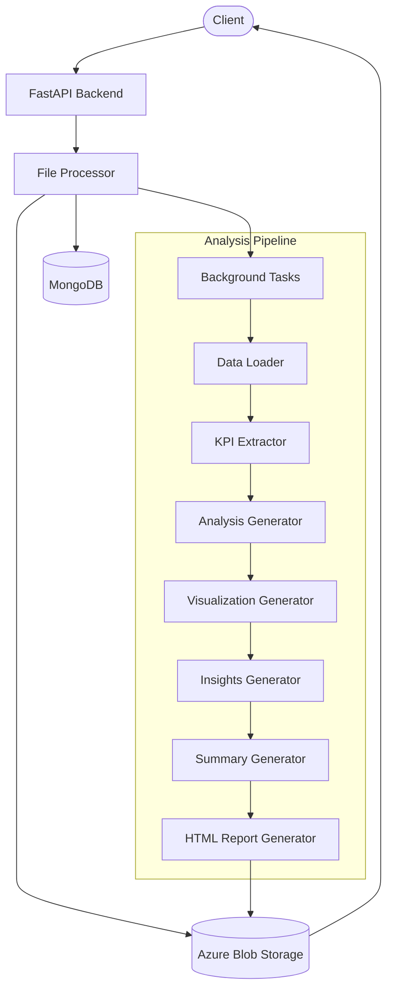
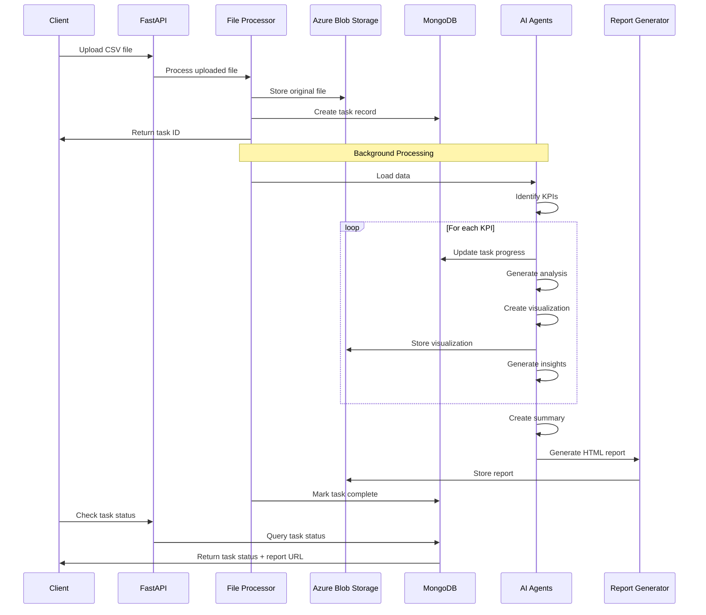
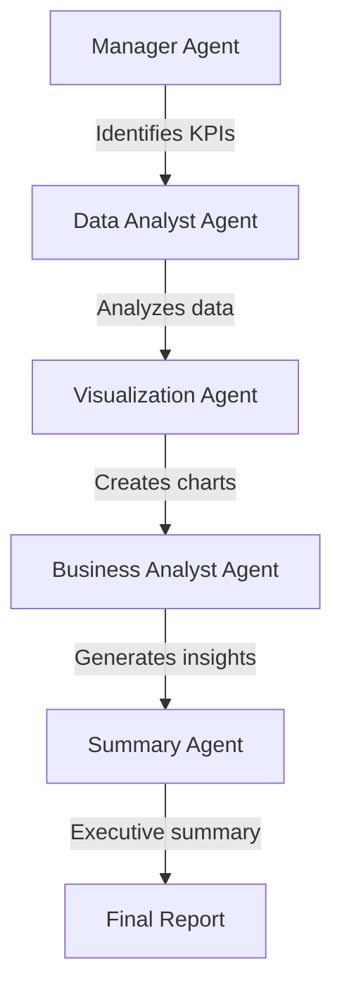

# Deep Analysis

## Overview
Deep Analysis is a powerful automated data analysis service designed to streamline the process of extracting insights from CSV files. Using a system of intelligent agents powered by AI, it automatically explores datasets, identifies key performance indicators (KPIs), generates visualizations, and produces comprehensive analytical reports with minimal human intervention.

This system is built with a FastAPI backend, Azure Blob Storage for file management, and MongoDB for task tracking and logging.

## Architecture



## Data Flow



## Core Components

### API Endpoints

- `GET /`: Serves the landing page
- `GET /health`: Health check endpoint
- `POST /analyze/`: Upload a CSV file to start analysis
- `GET /task/{task_id}`: Get the status of an analysis task

### Service Modules

1. **File Processor**: Handles file uploads, storage, and manages the background task process
2. **Data Loader**: Reads and validates CSV files with multiple encoding support
3. **KPI Extractor**: Identifies relevant metrics to analyze from the dataset
4. **Analysis Generator**: Performs statistical analysis for each KPI
5. **Visualization Generator**: Creates visualizations for the analyzed data
6. **Insights Generator**: Provides business insights based on analysis results
7. **Summary Generator**: Creates an executive summary of all insights
8. **HTML Report Generator**: Compiles all results into a beautiful, interactive HTML report

## AI Agent System

The system uses multiple specialized AI agents to perform different analytical tasks:



Each agent has a specific role:
- **Manager Agent**: Analyzes the dataset structure and identifies relevant KPIs
- **Data Analyst Agent**: Generates Python code to analyze each KPI
- **Debug Agent**: Helps fix any errors in the generated analysis code
- **Visualization Agent**: Creates appropriate visualizations for each KPI
- **Business Analyst Agent**: Interprets analysis results and provides insights
- **Summary Agent**: Synthesizes all insights into an executive summary

## Setup and Installation

### Prerequisites

- Python 3.8+
- MongoDB
- Azure Blob Storage account
- OpenAI API key

### Environment Variables

Create a `.env` file with the following variables:

```
BLOB_STORAGE_ACCOUNT_KEY=your_azure_blob_storage_connection_string
OPENAI_API_KEY=your_openai_api_key
MONGODB_CONNECTION_STRING=your_mongodb_connection_string
```

### Installation Steps

1. Clone the repository
```bash
git clone https://github.com/your-username/deep-analysis.git
cd deep-analysis
```

2. Create a virtual environment
```bash
python -m venv venv
source venv/bin/activate  # On Windows: venv\Scripts\activate
```

3. Install dependencies
```bash
pip install -r requirements.txt
```

4. Run the application
```bash
python app.py
```

The API will be available at `http://localhost:8000`

## Usage

1. **Upload a CSV file**:
   - Send a POST request to `/analyze/` with the CSV file
   - Receive a task ID in the response

2. **Check analysis status**:
   - Send a GET request to `/task/{task_id}` to check the progress
   - When complete, you'll receive a URL to the generated report

3. **View the report**:
   - Access the report URL to view the comprehensive analysis

## Project Structure

```
deep-analysis/
├── app.py                  # Main FastAPI application
├── templates/
│   └── index.html          # Landing page
├── database/
│   └── get_client.py       # MongoDB client
├── utils/
│   ├── file_processor.py   # File upload and processing logic
│   ├── html_report_generator.py # HTML report generation
│   ├── prompts.py          # AI agent prompts
│   ├── schemas.py          # Data schemas
│   └── services.py         # Analysis services
```

## Report Example

The final report includes:
- Executive summary
- List of analyzed KPIs
- For each KPI:
  - Interactive visualization
  - Detailed analysis results
  - Business insights and recommendations

## License

MIT License

Copyright (c) 2025

Permission is hereby granted, free of charge, to any person obtaining a copy
of this software and associated documentation files (the "Software"), to deal
in the Software without restriction, including without limitation the rights
to use, copy, modify, merge, publish, distribute, sublicense, and/or sell
copies of the Software, and to permit persons to whom the Software is
furnished to do so, subject to the following conditions:

The above copyright notice and this permission notice shall be included in all
copies or substantial portions of the Software.

THE SOFTWARE IS PROVIDED "AS IS", WITHOUT WARRANTY OF ANY KIND, EXPRESS OR
IMPLIED, INCLUDING BUT NOT LIMITED TO THE WARRANTIES OF MERCHANTABILITY,
FITNESS FOR A PARTICULAR PURPOSE AND NONINFRINGEMENT. IN NO EVENT SHALL THE
AUTHORS OR COPYRIGHT HOLDERS BE LIABLE FOR ANY CLAIM, DAMAGES OR OTHER
LIABILITY, WHETHER IN AN ACTION OF CONTRACT, TORT OR OTHERWISE, ARISING FROM,
OUT OF OR IN CONNECTION WITH THE SOFTWARE OR THE USE OR OTHER DEALINGS IN THE
SOFTWARE.

## Contact

For API access and inquiries: ab0358031@gmail.com

